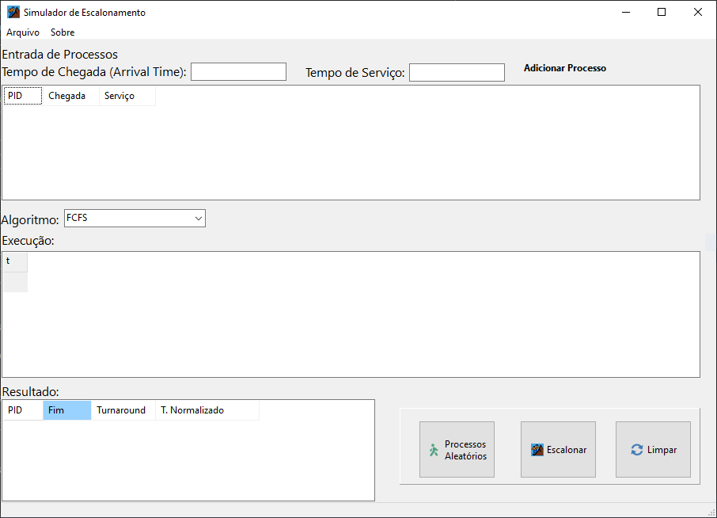

# SimEscalo

**SimEscalo** é um simulador educacional de algoritmos de escalonamento de processos, desenvolvido com C++Builder. 
Ele permite simular visualmente a execução de processos com base em diferentes políticas de escalonamento, gerando um diagrama de Gantt e uma tabela de resultados.

---

## ⚙️ Algoritmos disponíveis

- 🟢 FCFS — First-Come First-Served  
- 🟢 RR — Round Robin (configurável com quantum)  
- 🟢 SPN — Shortest Process Next  
- 🟢 SRT — Shortest Remaining Time

---

## 🖼️ Interface do programa

---

## 📦 Download

Você pode baixar o executável clicando no link abaixo:

➡️ [Download SimEscalo.exe](https://raw.githubusercontent.com/hederdorneles/SimEscalo/d20ac70a7de62442b4218d5eeebc3bdd8f0d9a26/Win64/Debug/SimEscalo.exe)

> ⚠️ Para Windows 64-bit. Não requer instalação.

---

## 🧪 Funcionalidades principais

- Adição manual ou automática de processos
- Diagrama de Gantt gerado em tempo real
- Resultados por processo:
  - Tempo de fim
  - Turnaround
  - Turnaround normalizado
- Interface simples com foco educacional

---

## 🚀 Como usar

1. Execute o `SimEscalo.exe`
2. Escolha o algoritmo desejado
3. Adicione os processos manualmente ou clique em **Gerar Valores**
4. Clique em **Simular**
5. Visualize o Gantt e os resultados!

---

## 🔗 Repositório

📁 [https://github.com/hederdorneles/SimEscalo](https://github.com/hederdorneles/SimEscalo)

---

## 📜 Licença

Este projeto é de uso livre para fins educacionais.
